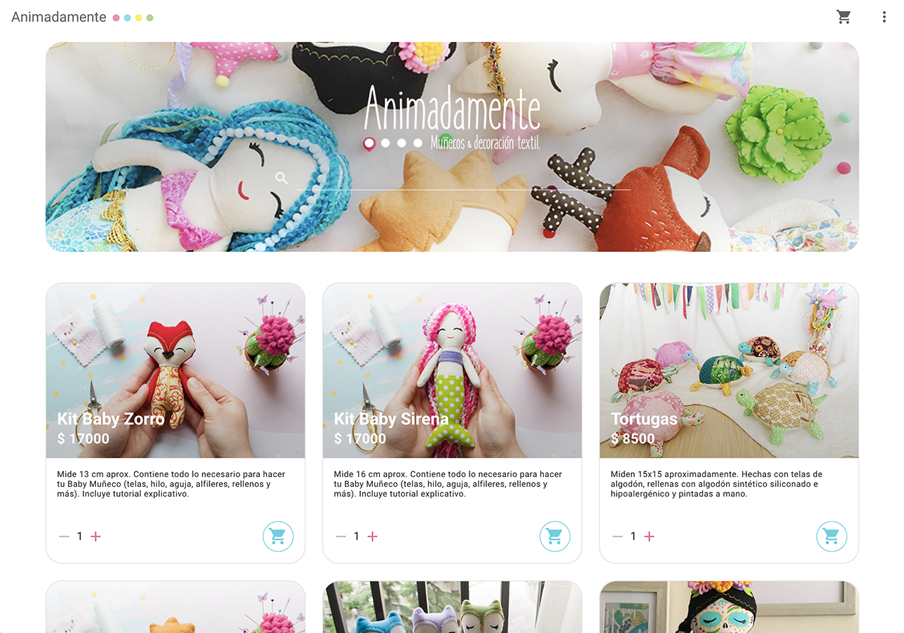
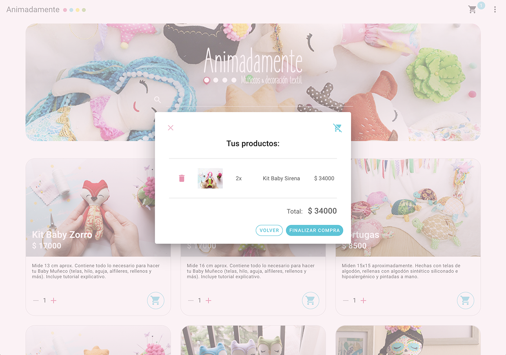
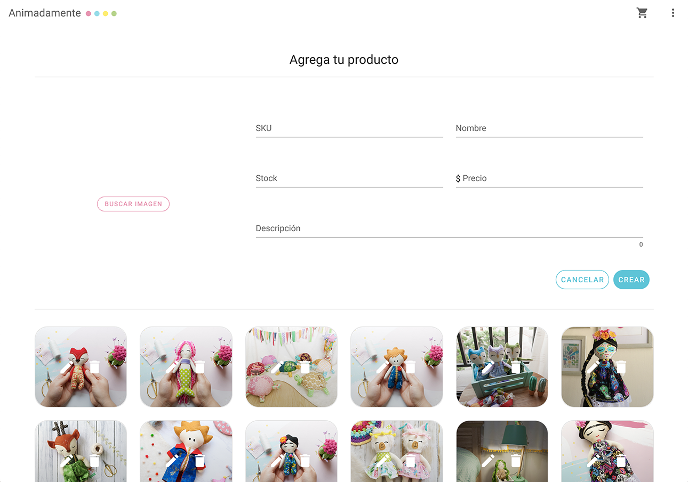

# Animadamente

Web development of an online shopping site for Animadamente, a hand-made doll design chilean company.





## Project setup

1. Root folder
```
npm install
```
---

2. Firebase config

```
mkdir config
touch firebase.js
```
Inside firebase.js, paste your own Firebase SDK snippet.

---

3. Firebase functions folder

```
cd functions
npm install
```

---
NPM commands

* `npm run serve` - hot-reloads for development.
* `npm run build` - minifies for production.

Firebase commands

* `firebase init` - to initialize Firebase on your project.
* `firebase deploy --only functions` - to connect ending points with cloudfunctions.
* `firebase deploy --only hosting` - to upload to Firebase hosting.

---

This project was built with Vuetify and Firebase Cloud Functions, Authentication, Database, Storage and Hosting.
 
You can see it running here: [animadamente-73568.web.app](https://animadamente-73568.web.app "Animadamente web test")

---

## Things to improve

- Better form validation .
- Image validation.
- Possibility to create an user.
- Welcoming page.
- Sort items.

And all back-end functions, this is only front-end.

---

## Special thanks

All pictures belong to **Animadamente.**

Visit [@animadamente](https://www.instagram.com/animadamente/ "Animadamente on Instagram") to see her work.

---
June 2020.


